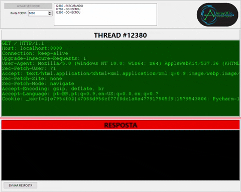

# Entendendo o HTTP para entender o REST

Olá!

Bem vindo aos exemplos práticos da palestra **Entendendo o HTTP para entender o REST**.

Os slides estão em: [https://www.slideshare.net/arrayof/entendendo-http-para-entender-o-rest-227569860](https://www.slideshare.net/arrayof/entendendo-http-para-entender-o-rest-227569860)

E o vídeo no nosso canal do Youtube: [https://youtu.be/x0HT3Dg53i4](https://youtu.be/x0HT3Dg53i4)

## Resumo

O  aplicativo mostra a interpretação do protocolo HTTP diretamente de uma comunicação TCP/IP - ou seja sem um framerwork.

O objetivo é mostrar alguns conceitos do padrão REST utilizando o protocolo HTTP.

## Abstract

The application shows the interpretation of the HTTP protocol directly from a TCP/IP communication - that is, without a framerwork.

The objective is to show some concepts of the REST standard using the HTTP protocol.

## Utilização

Basicamente deve-se iniciar o aplicativo e utilizar algum aplicativo cliente - seu navegador preferido, o Postman, o cURL ...

O aplicativo mostra o conteúdo da reqisição e permite escrever a resposta.

## Usage

Basically you should start the application and use some client application - your favorite browser, Postman, cURL ...

The application shows the content of the request and allows you to write the answer.

